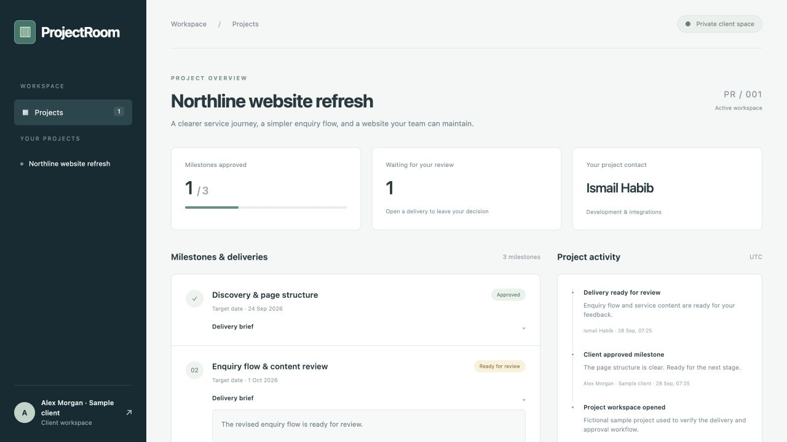
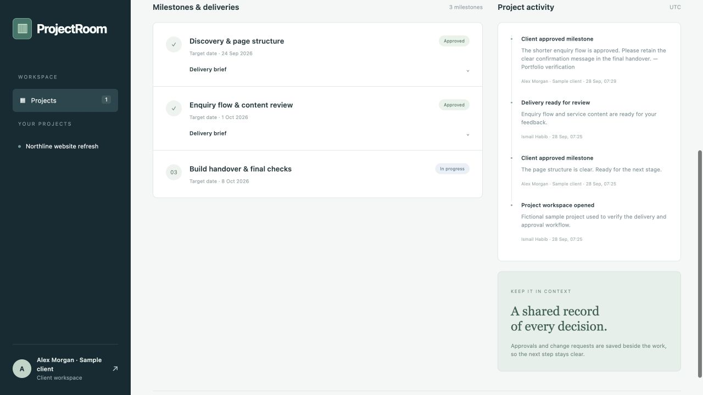

# ProjectRoom — Private Client Delivery & Approval Portal

A private WordPress workspace puts milestones, protected delivery briefs, client approvals, change requests and actor-attributed activity in one place, with access checked against the assigned project member.

## What it does

- Native WordPress login and client membership checks
- Private delivery brief downloads behind access checks
- Change request, revision and approval state workflow
- Staff project creation and actor-attributed history

## Screenshots

Actual running application, captured with labelled synthetic test data.

Actual authenticated client overview showing milestone progress, review status, the project contact and activity history.

Actual saved client decision with updated milestone status and activity history.

## Quick start

Requirements: Docker Desktop running, Python 3, and internet access for the initial official container-image download if it is not cached. No API key or external application account is required.

1. Open **Start WordPress.command** in this folder (or run `python3 wordpress_setup.py` from this folder).
2. Wait for the initialization message.
3. Open **http://127.0.0.1:8196**.

The launcher generates fresh database and login passwords in `.local.env` with owner-only permissions. It initializes WordPress and the original sample programme once. Subsequent launches reuse the same database and WordPress volumes. It does not replace existing bookings, clients or projects.

Staff login: **port_admin**, with the password from `WP_ADMIN_PASSWORD` in `.local.env`. WordPress administration: `http://127.0.0.1:8196/wp-admin/`.

Do not share `.local.env`. It is excluded from source control and installable ZIPs. Keep it with your local installation: the project name in it identifies the persistent Docker volumes. Do not delete it when stopping the project.

## Stop and resume

Open **Stop WordPress.command**, or run `docker compose --env-file .local.env stop`. This keeps data. Open the start command to resume. The service binds only to your computer's loopback address, not your public network interface.

## Editable WordPress source and installable packages

- `wordpress/projectroom/`: custom responsive theme.
- `wordpress/projectroom-portal/`: application plugin and database tables.
- `projectroom.zip`: installable WordPress theme.
- `projectroom-portal.zip`: installable WordPress plugin.
- `wordpress/bootstrap.php`: local setup and original sample content.
- `compose.yaml`: official image digests, storage and local-only port mapping.
- `test_wordpress.py`: live integration tests against the local WordPress application.
- `TEST_RESULTS.md`: recorded verification results.
- `screenshots/`: material.

To install in another WordPress environment, install and activate the plugin ZIP, then install and activate the theme ZIP. Plugin activation creates its tables. The local bootstrap is specific to the supplied Docker environment and should not be run on a client installation. Create your own content through the application after installation.

## Verification

Run `python3 test_wordpress.py` while the local application is running. It signs in with the generated local credentials, creates clearly named temporary fixtures, and deletes them at the end. Tests rely on the original sample workspace remaining available. See `TEST_RESULTS.md` for the recorded run and scope.

## Boundaries

Locally verified independent project with fictional sample clients and project content. One assigned client per project; administrator staff. No file upload, email, invoicing or public hosting. Delivery briefs are private text downloads.

A public deployment would require your own hostname, HTTPS, maintained WordPress hosting, backups, retention choices, monitoring and an appropriate authentication/abuse-control setup. Public deployment has not been performed or verified here. 

## Client and staff accounts

Client login: **port_client**, password `WP_CLIENT_PASSWORD` in `.local.env`.

A second test client, **port_other**, uses `WP_OTHER_PASSWORD`. It owns a separate sample project to verify that the first client cannot see, download or modify its content. These are fictional WordPress subscriber accounts created only in this local installation.

## Use the project workflow

1. Sign in as the client to see only the assigned project.
2. Expand a delivery brief or download its private text file.
3. For a milestone marked **Ready for review**, approve it or explain the changes required.
4. Sign in as staff to revise a milestone after a change request, or prepare an active milestone for review.
5. Every accepted state change records the account, event, note and UTC timestamp in project activity.

Staff can create projects, assign an existing WordPress subscriber, add milestones with target dates and prepare delivery briefs. Add additional clients in **WordPress → Users** with the subscriber role. Each project has one assigned client. Administrators can manage all projects but cannot approve on behalf of a different assigned client.

An approved milestone remains complete; a repeated or stale approval is rejected. A change request must include feedback. Private deliverables are generated by a protected download handler after membership checks; they are not public files in the upload folder.

Staff can permanently delete a project and its milestones/history from **Project data management**. This cannot be undone by the application; maintain backups when using your own data.

## Implementation details

Native WordPress users, login cookies, capabilities and CSRF nonces govern authentication and authorization. Project membership is checked on each dashboard read, state transition and download. Milestone IDs are constrained to the selected project. InnoDB transactions update the milestone and activity together. The client-facing homepage sends private no-cache headers. All user text is escaped on output. Custom tables keep projects, milestones and the event history separate from theme presentation.

## Project documentation

- [Recorded verification](TEST_RESULTS.md)
- [Screenshot captions](screenshots/CAPTIONS.md)

## License

[MIT](LICENSE) © 2026 Ismail Habib.

The original theme, plugin and project source are MIT licensed. WordPress, MariaDB and their dependencies retain their respective licenses and are fetched separately by Docker; their source is not bundled in the theme or plugin ZIPs.
